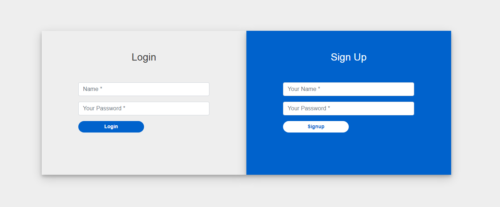
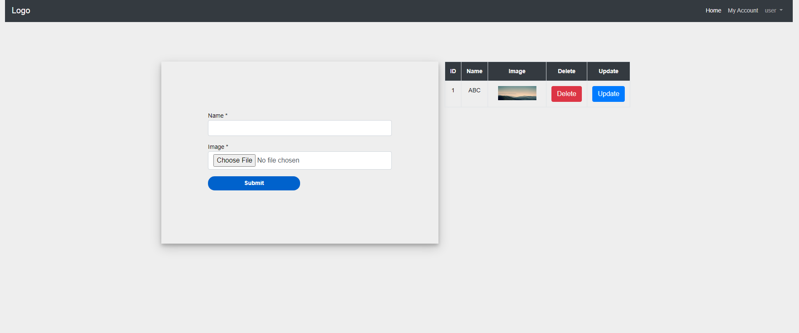

#Project: Dynamic slider with login protected update form

Note: this test is only for people who are qualified for first round. 

# How to start? 

1. Start Wamp server.
1. Select any one text editior Notepad++ or sublime text editor in desktop.
1. Use any browser Chrome or Mozila firefox.
1. What we want to check your skills in this test : HTML,CSS,Javascript,Bootstrap,PHP,MYSQL. -- correct 
1. Library list--

# Homepage

1. Dynamic header contains logo, & menu.
1. Menu items - Home & login.
1. Login menu - visible only for non logged in user
1. Dynamic slider -----On Home Page create image slider using javascript library. [link for slider library](https://swiperjs.com/demos/).

# Create Login and signup form

1. Validations - what to ? signup, login ----- email, pass -- 8 char
1. All signup details inserted into database. --------- validate-- and it must be unique.(No duplicate username).
1. Using Signup details login into loginform.

# Create Home page

1. After login successfully redirect to home page.
1. Header changes - after login user will not see login link. User will have link for dashboard. Usernmae will be displayed with logout url. See screenshots

# Create Myaccount page

1. On myaccount page show image upload form.
1. Form contains Name and image upload.
1. Data will be insterted to database. You have to upload files on server.
1. You can show inserted data below form

# Dynamic slider on homepage

1. Show uploaded images from upload form in slider. As soon as user upload image, it should reflect on homepage.
1. Title entered from upload form will appear on image in slider

# Bonus? 
1. Git init & commits.
1. Well structured & formatted code with coding styling standards.
1. Valid code
 
# Challenges :
1. Change slider as per user.
1. Javascript: Change carsoul/slider.
1. CSS+PHP: Active menu.
1. CSS: Resposive header and slider.
1. PHP+Mysql : Protect password with MD5
1. PHP,Mysql add Category.
